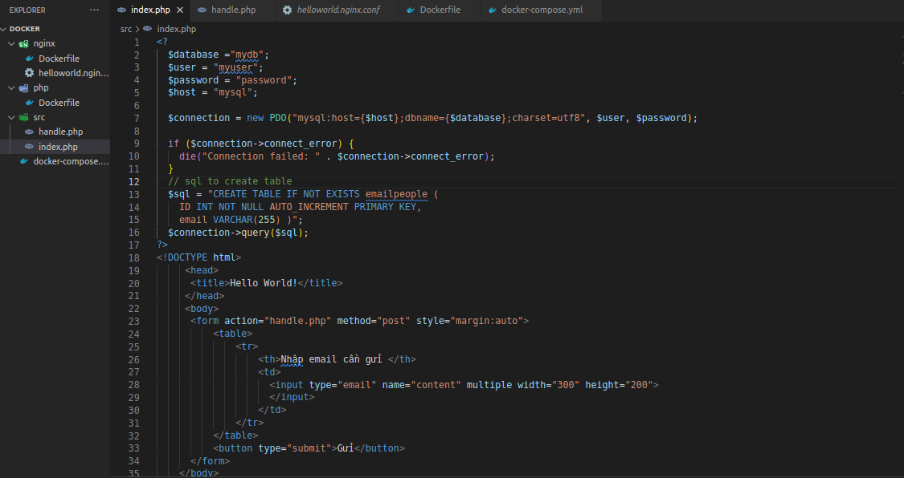

# Bài tập docker

1. Build 1 service php (https://hub.docker.com/_/php), 1 serivce nginx (https://hub.docker.com/_/nginx) để cho thể show được trang php info lên web bằng docker

* Build 1 service nginx

    * Write file Dockerfile
    

    * Build service nginx
    

    * Run service
    

    * Result
    

* Build 1 service php
    * Write file Dockerfile
    

    * Write file index.php
    
    

    * Build service nginx
    

    * Run service
    

    * Result
    

2. Tổ chức các service trên vào trong 1 file docker-compose.yml

    * Write file Dockerfile in folder nginx
    

    * Write file helloworld.config in folder nginx
    

    * Write file Dockerfile in folder php
    

    * Write file index.php in folder src
    

    * Write file docker-compose.yml
    

    * Build Docker compose
    

    * Run Docker compose
    

    * Result
    

3.  Thêm 1 service mysql (https://hub.docker.com/_/mysql), viết một chương trình php connect đến service mysql

    * Write file Dockerfile in folder nginx
    

    * Write file helloworld.config in folder nginx
    

    * Write file Dockerfile in folder php
    

    * Write file index.php in folder src
    

    * Write file docker-compose.yml
    

    * Build Docker compose
    

    * Run Docker compose
    

    * Result
    

4. Thêm 1 service mailhog (https://hub.docker.com/r/mailhog/mailhog/), tạo một form có thể nhập nhiều email và sau đó submit  những email đã nhập vào 1 table và gửi  1  template mail giới thiệu về bản thân đến những email đó. Dùng mailhog để tổ chức làm server mail để testing

    * Write file Dockerfile in folder php
    

    * Write file docker-compose.yml
    

    * Write file index.php in folder src
    

    * Write file handle.php in folder src
    

    * Write file handle.php in folder src
    

    * Build Docker compose
    

    * Run Docker compose
    

    * Result
    * Input email need send

    

    * List email databases

    

    

    

    

    