# Bài tập về git

1. Ở trên repo hiện tại, git config local username và email
    * Khởi tạo git

    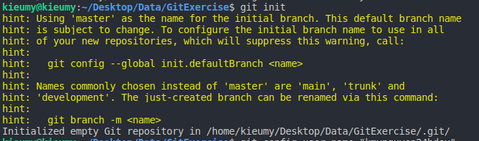

    * Git config local username và email

    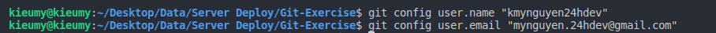

2. Checkout master 1 branch là develop

    * Tạo branch develop

    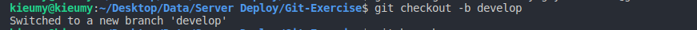

3. Trên branch develop tạo 1 file demo.log, 1 file index.html với nội dung in ra dòng chữ “Hello world”. Làm thế nào để git không tracking tất cả file .log (dùng .gitignore). Sau đó tạo 1 commit add file index.html

    * Tạo tập tin index.html và demo.log
    
    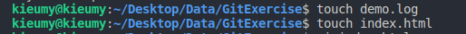

    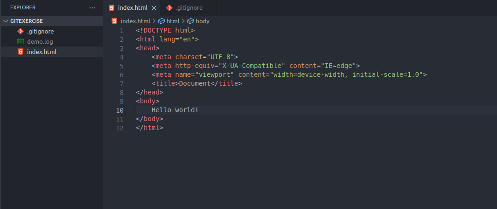
    
    * Tạo file .gitignore

    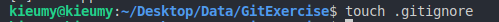

    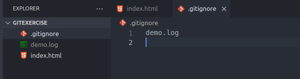  
 
    * Commit file vừa tạo
    
    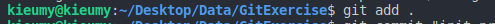

    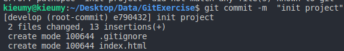

4. Sửa đổi nội dung trên file index.html sau đó làm thế nào để revert lại file index.html trước khi sửa đổi không dùng undo mà dùng lệnh git.

    * Sửa đổi nội dung file index.html

    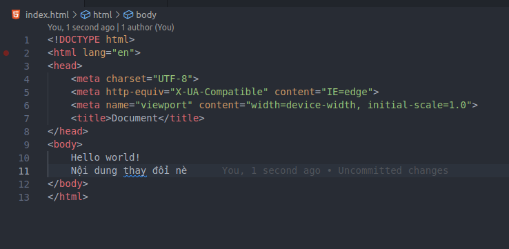

    * Commit file index.html

    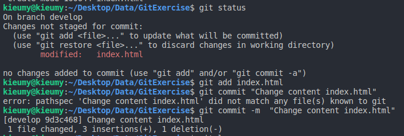

    * Trạng thái hiện tại

    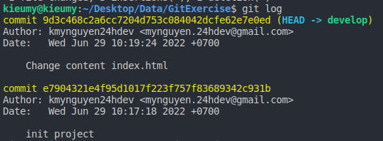

    * Revert file 

    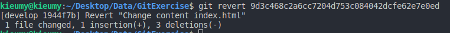

    * revert thành công và kết quả
    
    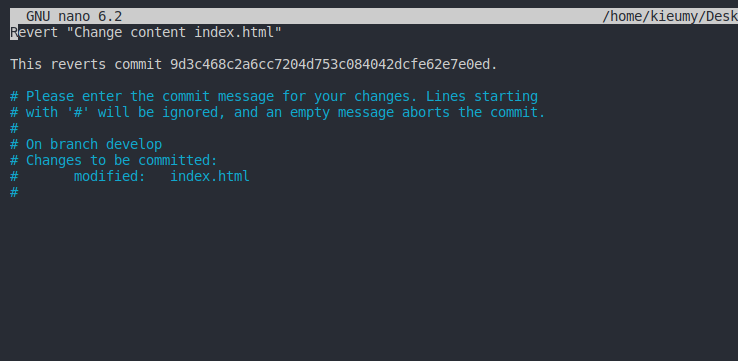

    

5. Tạo 1 file demo.html với nội dung in ra dòng chưa “This is file demo”, tạo một commit mới add file demo.html và push code lên origin.

    * Tạo 1 file demo.html với nội dung in ra dòng chưa “This is file demo”

    

    * commit file demo.html 

    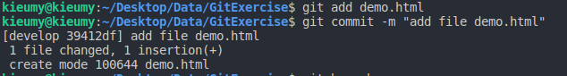

    * Kết nối remote
    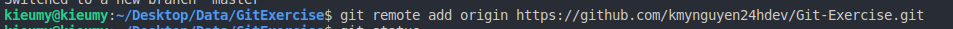

    * push code lên origin

    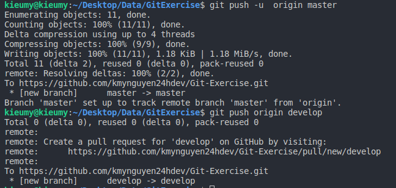

    * Result

    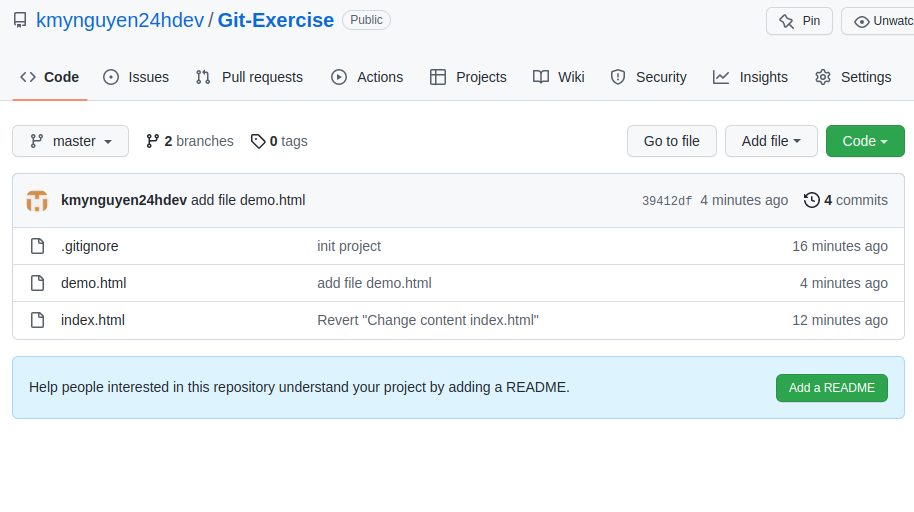

6. Sửa đổi lại nội dung file demo.html với nội dung “This is a demo file” như không tạo thêm một commit mới nào cả chỉ là thay thế commit cũ và push lại code lên origin
    
    * Thay đổi file demo.html

    * Kiểm tra trạng thái hiện tại

    * Add file demo.html và commit vào commit cũ

    

7. Tạo 1 branch mới là feature_a, rồi thêm môt file feature.html với nội dung bất kì rồi tạo một commit. Sử dụng git cherry-pick để lấy commit mới của feature_a vào branch develop. 

    * Tạo branch feature_a 

    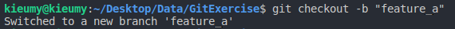

    * Tạo file feature.html, add và commit file

    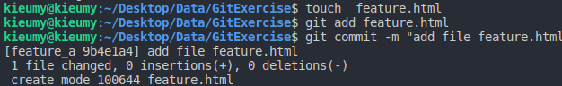

    * Chuyển sang branch develop cherry-pick feature_a

    (Vì hiện tại feature_a chỉ có 1 commit nên lấy luôn commit hiện có của feature_a)

    lấy commit cụ thể thì gắn hash sau cherry-pick

    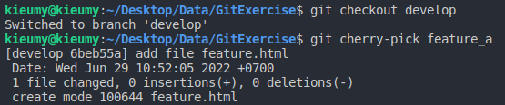

    * Kiểm tra

    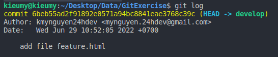

8. Sửa đổi file feature.html sau khi cherry-pick ở trên branch develop rồi tạo 1 commit. Sử dụng git rebase branch feature_a với branch develop (Nếu có conflict thì resolve và rebase --continue) 

    * Sửa đổi file feature.html và commit

    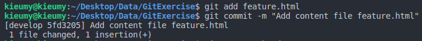

    * Xóa merge trước đó và chuyển sang branch feature_a

    ~[Del merge pre](./images/28git.png)

    * rebase branch develop và bị conflict 

    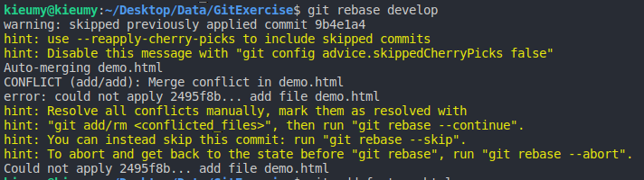

    * Sửa đổi file conflict và rebase lại

    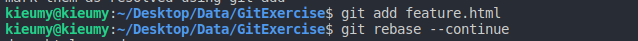
