# Bài user, group,  file , ssh

1. Tạo ở máy em 3 user user-A, user-B, user-C và 2 group group-A, group-B

* Bước 1: Tạo user-A, user-B, user-C và thiết lập password
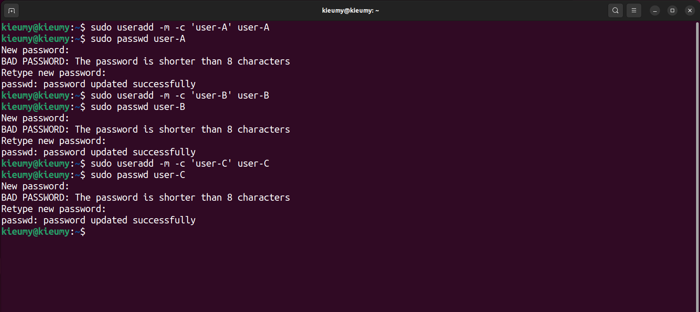

*  Bước 2: Tạo 2 group A và B

2. Cho user-A, user-B vào group-1, user-C vào group-2

* Bước 3: Thêm user-A, user-B vào group-A; thêm user-C vào group-B
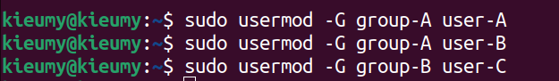

3. Tạo 1 file example.txt với phân quyền user-A có  read write exec, group-2 chỉ có read và exec. Các user còn lại có thể read.  Thử login vào user-C và sửa đổi file example.txt điều gì sẽ xảy ra?

* Bước 1: Tạo file example.txt

* Bước 2: Cấp quyền cho file example.txt 
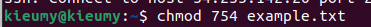

* Bước 3: Chuyển quyền sở hữu file example cho user-A
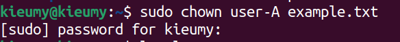

* Bước 4: Phân quyền cho group--B vào file example
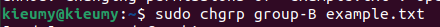

* Bước 5: Kiểm tra lại phân quyền của file example.txt
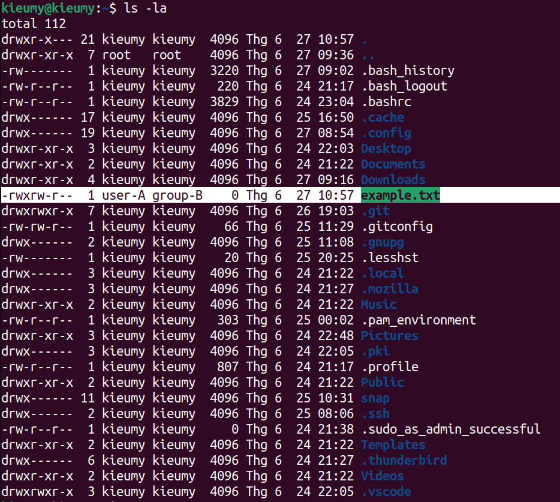

** Login vào user C va sửa file
* Bước 1: Đăng nhập user-C và chỉnh sửa file:
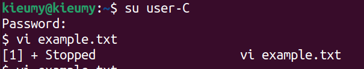

* Bước 2:Khi truy cập vào file sẽ thấy như hình

* Bước 3: Khi thay đổi file sẽ thấy cảnh báo, không thể thay đổi file

4. Upload 1 file đến VPN thông qua ssh để ở thư mục /home/ubuntu/k10
* Bước 1: Kết nối sever
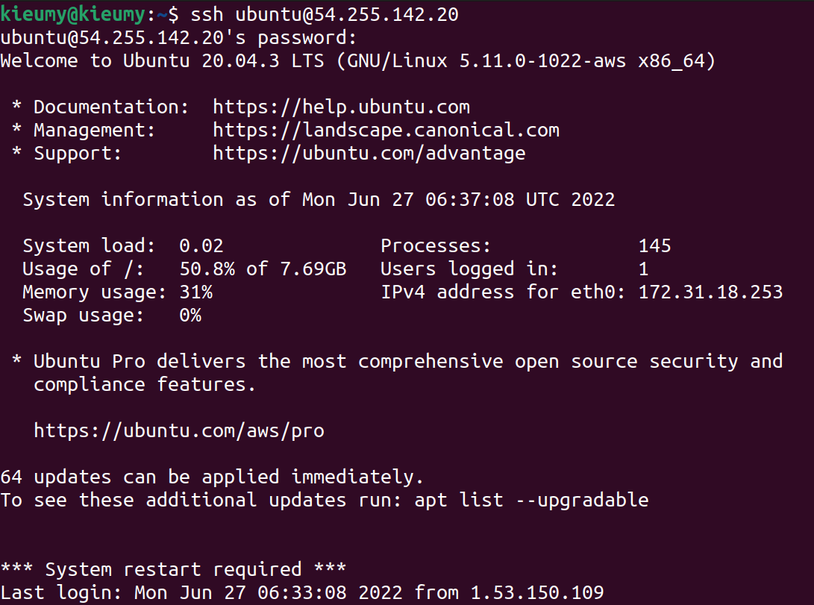

* Bước 2: Tạo file text1.txt va Upload file lên server
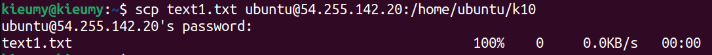

5. Download 1 file từ máy VPN thông qua ssh để ở thư mục /home/ubuntu/k10/download-test.txt
* Bước 1: Kết nối sever
* Bước 2: Download file download-test.txt tu server lưu vào thư mục data
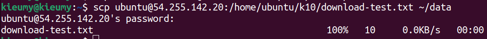

6. Config để 2 máy có thể ssh với nhau mà không cần đòi hỏi mật khẩu.
* Bước 1: Cấu hình máy khách tệp cấu hình OpenSSH toàn hệ thống

* Bước 2: Chỉnh sửa PasswordAuthentication thành no để không cần nhập mật khẩu khi đăng nhập
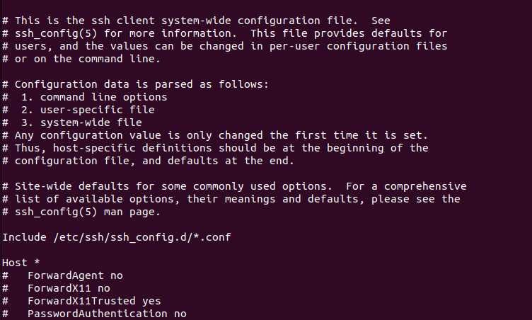

* Bước 3: Sử dụng SSH không cần mật khẩu
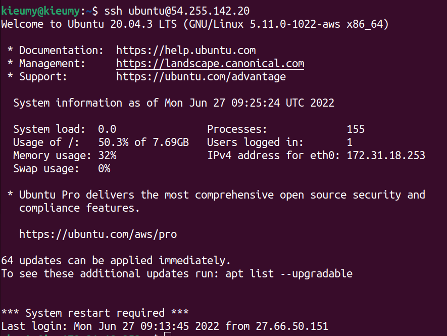

7. Sử dụng public key và private key để bảo mật connect giữa 2 máy. 

* Bước 1: Kiểm tra xem SSH key cho máy có sẵn chưa

* Bước 2: Tạo cặp khóa public và private key
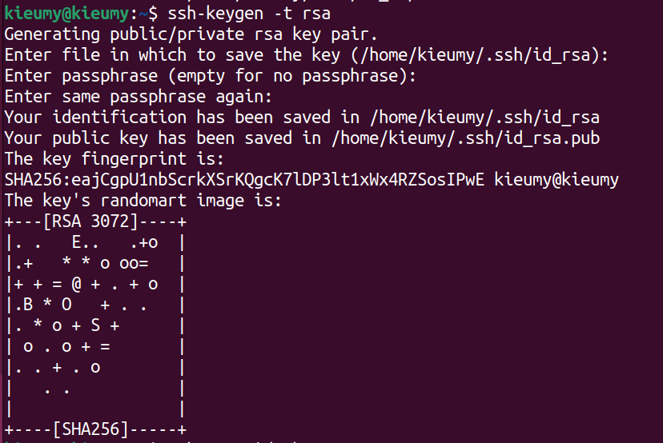

* Bước 3: Copy Public Key để kích hoạt SSH without password
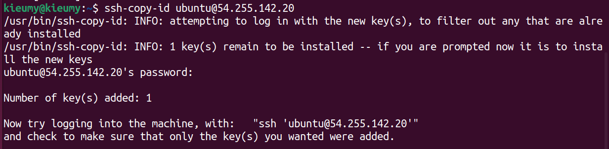

* Bước 4: Ket noi ubuntu
