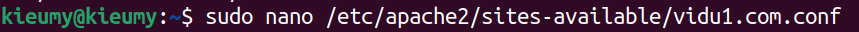
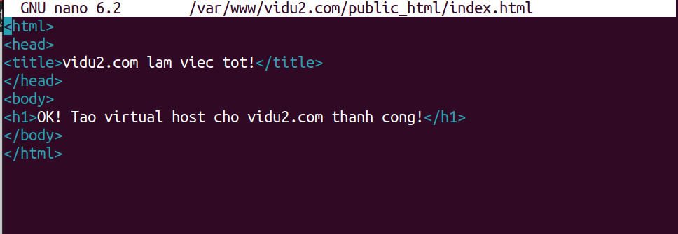
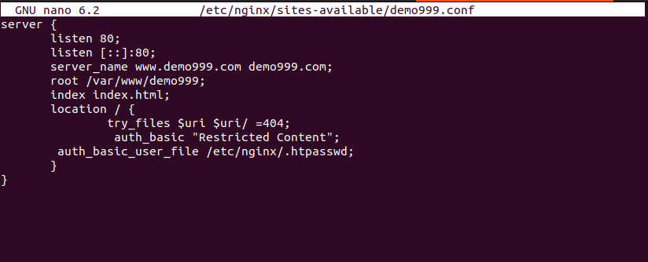

# Bài virtual host, server block apache , nginx

1. Cài đặt apache, ngnix

* Cài đặt apache

* Cài đặt ngnix

2. Tạo trên máy mình 2 vitrual host để truy cập đến 2 resource web khác nhau bằng apache

* Bước 1: Tạo thư mục để chứa tập tin và dữ liệu của hai trang web

* Bước 2: Tạo tập tin cấu hình virtual host
    
    * Mở và chỉnh sửa tập tin cấu hình/etc/apache2/sites-available/vidu1.com.conf

    

    
    
    * Mở và chỉnh sửa tập tin cấu hình/etc/apache2/sites-available/vidu2.com.conf

    

    

* Bước 3: Bật virtual host để các cấu hình hoạt động va Khởi động lại máy chủ web Apache

    

* Bước 4: Kiểm tra xem việc tạo virtual host trên Apache
    * Tạo tập tin index.html trong /var/www/vidu1.com/public_html
    

    * Nội dung file index.html for vidu1 
    

    * Tạo tập tin index.html trong /var/www/vidu2.com/public_html
    

    * Nội dung file index.html for vidu2
    

* Bước 5 : Cuối cùng, trỏ domain về IP của server
    

    Thêm tên miền
    

* Kết quả 
    * Truy cập vào địa chỉ vidu1.com 
    

    * Truy cập vào địa chỉ vidu2.com
    

3. Tương tự như vậy nhưng làm với với nginx Hướng dẫn cấu hình Virtual Hosts trên Nginx

* Bước 1: Tạo thư mục lưu trữ source code cho 2 website

* Bước 2: Tạo file index.html cho website vinasupport-1.com, đặt nó ở đường dẫn /var/www/vinasupport_1/index.html 

    * Phân quyền truy cập cho file /var/www/vinasupport_1
    

    * Add content for file /var/www/vinasupport_1 

    

    * Phân quyền truy cập cho file /var/www/vinasupport_2
    

    * Add content for file /var/www/vinasupport_2

    

* Bước 3 : Tạo 2 file Virtual Hosts cho 2 domain

    * Access to /etc/nginx/sites-available/vinasupport-1.conf

    

    * Add content for file /etc/nginx/sites-available/vinasupport-1.conf

    

    * Access to /etc/nginx/sites-available/vinasupport-2.conf

    

    * Add content for file /etc/nginx/sites-available/vinasupport-2.conf

    

* Bước 4 : tạo 2 file symbolic link tới thư mục /etc/nginx/sites-enabled/

Reload lại service của Nginx Web Server

* Bước 5 : Change domain for virtual host

* Results

4. Làm một vitrual host tại máy em. Khi truy cập vào vào http://demo.com sẽ show ra dòng chữ Hello world trên trang web.

* Bước 1: Create folder demo999, change permission for file and add index.html

 

* Bước 2: Create and add config for file demo 

* Bước 3: Create file symbolic link to folder /etc/nginx/sites-enabled/

* Bước 4 : Change domain for virtual host

* Reload server

* Result

5. Tạo 1 authenticate basic khi vào trang demo.com sẽ bắt nhập username và password. Gợi ý (.htaccess của apache hoặc auth_basic key của nginx)

* Bước 1: Create a file .htpasswd to save username and password into folder
/etc/nginx

* Bước 2: Create password for haposoft

* Show file created 

* Bước 3: Config accuracy password Nginx 

* Result 

6. (Optional) Tạo ssl (htttps) cho web server with nginx.
